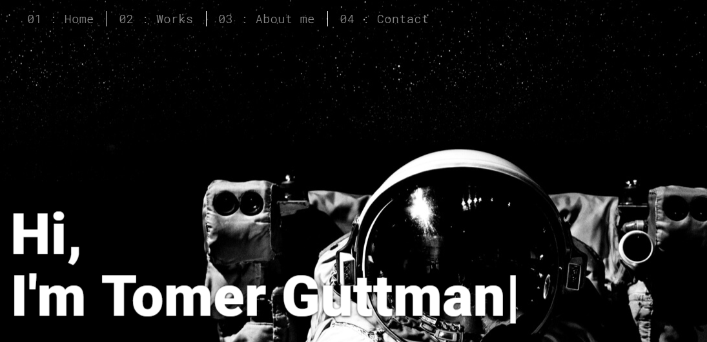

 

# tguttman-portfolio-flask-web 🧪

To enter the portfolio website please click [Here](http://tomergut.pythonanywhere.com/)

> The portfolio website was developed using with the following technologies:   `HTML & CSS` `Flask` `Python`

## Key Learnings
- HTML
- CSS
- FLASK
- JavaScript
- Python
- Linux VM

## Built With

* [Unsplash](https://unsplash.com/) - Unsplash is a website dedicated to sharing stock photography under the Unsplash license
* [Python](https://www.python.org/) - Python is an interpreted, high-level, general-purpose programming language
* [Flask](https://palletsprojects.com/p/flask/) - Flask is a lightweight WSGI web application framework. It is designed to make getting started quick and easy, with the ability to scale up to complex applications
* [pythonanywhere](https://www.pythonanywhere.com/) - PythonAnywhere is an online integrated development environment and web hosting service based on the Python programming language

## License

This project is licensed under the MIT License - see the [LICENSE.md](LICENSE.md) file for details

